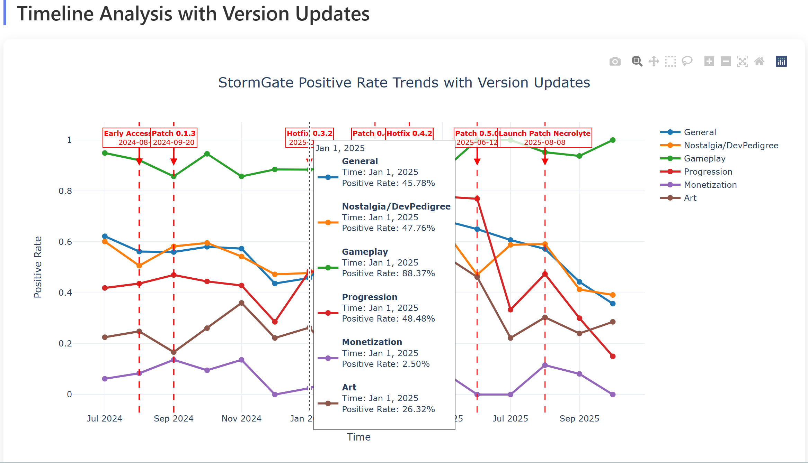

# Game Review Analytics Pipeline

A comprehensive pipeline for analyzing game reviews using Aspect-Based Sentiment Analysis (ABSA) and interactive data visualization dashboards. This project demonstrates the complete workflow from Steam API data collection to professional-grade analytics dashboards, using StormGate as a case study.



## 🎯 Project Overview

This project provides a complete, reusable pipeline for analyzing any game's reviews, from Steam API data collection to interactive visualization. It combines machine learning techniques for Aspect-Based Sentiment Analysis (ABSA) with professional-grade dashboards to provide insights into player feedback and version update impacts. 

**StormGate is used as a case study** to demonstrate the pipeline's capabilities, but the system is designed to work with any Steam game by simply changing the app ID and game-specific data.

## 📁 Project Structure

```
Game-Review-Analytics-Pipeline/
├── ABSA/                                    # Aspect-Based Sentiment Analysis
│   ├── fetch_and_save_reviews.py           # Steam reviews data collection
│   ├── absa_embedding.py                   # ML model for aspect sentiment analysis
│   ├── aspect_sentiment_results_OneByOne_700_multiaspect.csv
│   ├── steam_reviews_labeled_OneByOne_700.csv
│   ├── steam_reviews_raw_withTime5000.csv
│   └── training_loss_curve.png
├── Dashboard/                               # Interactive visualization dashboards
│   ├── enhanced_dashboard.py               # Main dashboard generator
│   ├── enhanced_stormgate_dashboard.html   # Generated HTML dashboard
│   ├── stormgate_dashboard.py              # Dash-based dashboard
│   ├── simple_dashboard.py                 # Simplified dashboard
│   ├── streamlit_dashboard.py              # Streamlit dashboard
│   ├── basic_dashboard.py                  # Basic HTML generator
│   ├── run_dashboard.py                    # Dashboard launcher
│   ├── test_streamlit.py                   # Streamlit test
│   ├── test_data_loading.py               # Data loading test
│   ├── dashboard_requirements.txt          # Dashboard dependencies
│   ├── StormGatePatches                    # Version update data (raw)
│   └── StormGatePatches_fixed.csv         # Version update data (processed)
├── Cover.png                                # Project showcase image
├── README.md                                # Main project 
```


### Installation

1. **Clone the repository**
   ```bash
   git clone <repository-url>
   cd Game-Review-Analytics-Pipeline
   ```

2. **Install dependencies**
   ```bash
   pip install -r requirements.txt
   ```

3. **Install dashboard dependencies**
   ```bash
   cd Dashboard
   pip install -r dashboard_requirements.txt
   cd ..
   ```

### Usage

#### 1. Data Collection and Analysis

**Collect Steam Reviews for Any Game:**
```bash
cd ABSA
# Edit fetch_and_save_reviews.py to change STEAM_APP_ID
python fetch_and_save_reviews.py
```

**Run Aspect-Based Sentiment Analysis:**
```bash
python absa_embedding.py
```

#### 2. Generate Interactive Dashboard

**Enhanced HTML Dashboard :**
```bash
cd Dashboard
python enhanced_dashboard.py
```

## 📊 Features

### 🔍 Data Collection
- **Steam API Integration**: Automated review collection from Steam
- **Multi-language Support**: Configurable language filtering
- **Rate Limiting**: Built-in delays to respect API limits
- **Data Validation**: Quality checks and duplicate removal

### 🤖 Machine Learning Pipeline
- **Aspect-Based Sentiment Analysis**: Multi-aspect sentiment classification
- **Semantic Embeddings**: Using Qwen3-Embedding-0.6B model
- **Neural Network Training**: Custom architecture for aspect detection
- **Performance Metrics**: Comprehensive evaluation metrics

### 📈 Interactive Dashboards
- **Real-time Visualization**: Dynamic charts with Plotly.js
- **Version Update Tracking**: Timeline annotations for game updates
- **Multi-dimensional Analysis**: Aspect, sentiment, and temporal analysis
- **Professional UI**: Modern design with responsive layout

### 📊 Analytics Capabilities
- **Sentiment Distribution**: Overall and aspect-specific sentiment analysis
- **Trend Analysis**: Time-series analysis with version update impacts
- **Heatmap Visualization**: Aspect sentiment over time
- **Version Impact Assessment**: Before/after update analysis

## 🎨 Dashboard Features

### Overview Analysis
- **Sentiment Distribution**: Pie chart showing overall sentiment
- **Aspect Analysis**: Bar chart showing sentiment by aspect
- **Key Metrics**: Total reviews, aspects, positive/negative rates

### Timeline Analysis
- **Version Update Annotations**: Visual markers for game updates
- **Trend Lines**: Aspect sentiment trends over time
- **Interactive Hover**: Detailed information on hover

### Heatmap Analysis
- **Positive Rate Heatmap**: Aspect sentiment over time
- **Negative Rate Heatmap**: Problem areas identification
- **Discussion Frequency**: Aspect popularity over time

### Version Impact Analysis
- **Update Effectiveness**: Before/after comparison
- **Aspect-specific Impact**: Detailed version update analysis
- **Change Quantification**: Statistical impact measurement

## 🔧 Technical Stack

### Data Processing
- **Pandas**: Data manipulation and analysis
- **NumPy**: Numerical computing
- **Requests**: HTTP requests for API calls

### Machine Learning
- **Sentence Transformers**: Semantic embeddings
- **PyTorch**: Neural network implementation
- **Scikit-learn**: ML utilities and metrics
- **Matplotlib**: Training visualization

### Visualization
- **Plotly**: Interactive charts and graphs
- **Streamlit**: Web application framework
- **Dash**: Advanced web applications
- **HTML/CSS/JavaScript**: Custom dashboard styling

## 📈 Data Insights

The project analyzes (using StormGate as a case study):
- **21,859+ processed reviews** from StormGate
- **15 unique aspects** (Gameplay, Graphics, Audio, etc.)
- **10 version updates** with impact analysis
- **Time range**: August 2024 to October 2025

### Key Findings (StormGate Case Study)
- **Overall Positive Rate**: ~44%
- **Most Discussed Aspects**: General, Nostalgia/DevPedigree, Progression
- **Version Impact**: Patch 0.4.1 and 0.4.2 showed significant positive impact
- **Trend Analysis**: Clear correlation between updates and sentiment changes

## 🎯 Use Cases

### Game Developers
- **Version Impact Assessment**: Measure update effectiveness
- **Player Feedback Analysis**: Identify improvement areas
- **Data-driven Decisions**: Make informed development choices

### Product Managers
- **Feature Prioritization**: Focus on high-impact improvements
- **Release Planning**: Optimize update timing and content
- **Player Satisfaction**: Monitor sentiment trends

### Data Analysts
- **Sentiment Analysis**: Advanced aspect-based analysis
- **Trend Prediction**: Forecast player sentiment changes
- **Impact Measurement**: Quantify update effectiveness

### Community Managers
- **Sentiment Monitoring**: Real-time community health tracking
- **Issue Identification**: Early problem detection
- **Communication Strategy**: Data-informed community engagement

## 🔄 Workflow

1. **Data Collection**: Fetch reviews from Steam API
2. **Data Processing**: Clean and validate review data
3. **ML Training**: Train aspect-based sentiment analysis model
4. **Prediction**: Generate sentiment predictions for all reviews
5. **Visualization**: Create interactive dashboards
6. **Analysis**: Extract insights and trends

## 📊 Performance Metrics

### Model Performance
- **Accuracy**: >85% on aspect classification
- **F1-Score**: >0.8 for sentiment classification
- **Processing Speed**: ~1000 reviews/minute

### Dashboard Performance
- **Load Time**: <3 seconds for full dashboard
- **Interactivity**: Real-time chart updates
- **Responsiveness**: Mobile-friendly design

## 🛠️ Configuration

### Data Collection Settings
```python
STEAM_APP_ID = 2012510  # Change this to any Steam game's app ID
LANGUAGE = "english"    # Review language filter
MAX_REVIEWS = 5000     # Maximum reviews to fetch
DELAY_SECONDS = 2.0    # Request delay
```

### Model Settings
```python
model_name = "Qwen/Qwen3-Embedding-0.6B"
batch_size = 16
learning_rate = 0.001
epochs = 50
```

### Adapting to Other Games
To analyze a different game:
1. **Find the Steam App ID**: Visit the game's Steam store page and copy the ID from the URL
2. **Update Configuration**: Change `STEAM_APP_ID` in `ABSA/fetch_and_save_reviews.py`
3. **Collect Data**: Run the data collection pipeline
4. **Update Dashboard**: Modify dashboard titles and labels as needed

## 🙏 Acknowledgments

- **Steam API**: For providing review data
- **Qwen Team**: For the embedding model
- **Plotly**: For interactive visualization
- **Streamlit/Dash**: For web application frameworks
